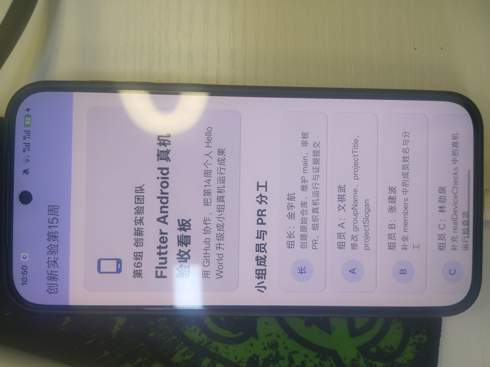
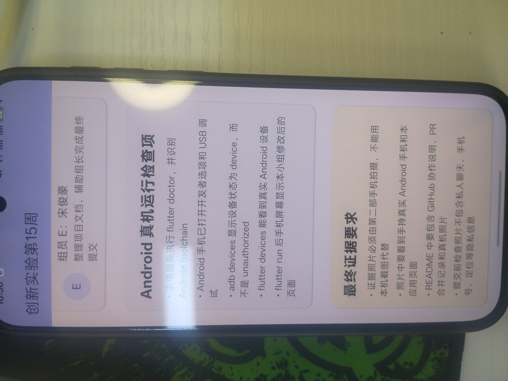

# Flutter Android 真机验收看板

本仓库用于完成第15周课堂任务：在第14周 Flutter Hello World 与 GitHub 提交练习基础上，整理小组 Flutter 项目，并把最终版本运行到真实 Android 手机上完成验收。

**项目口号**：用github协作，把第十四周个人hello world升级成小组真机运行结果

- GitHub 仓库：<https://github.com/JinJinJinyh/innovation-week15-team-device>
- 项目名称：Flutter Android 真机验收看板
- 小组名称：第六组
- App 显示名称：Android真机展示
- 当前验收日期：2026-06-12

## 课堂任务要求对照

| 要求 | 本仓库完成情况 |
| --- | --- |
| 创建 GitHub 原始仓库 | 已创建 `innovation-week15-team-device` 仓库 |
| 小组成员基于 Flutter 项目协作修改 | 已在 [lib/main.dart](lib/main.dart) 中完成小组名称、成员分工、真机检查项和证据规则 |
| 组长合并最终版本到 `main` | 当前最终版本整理在 `main` 分支 |
| App 运行到真实 Android 手机 | 已在 PKB110 Android 真机上运行成功 |
| README 展示真机照片和分工 | 本 README 已补充成员分工、运行记录和真机照片 |

## 小组成员与分工

| 角色 | 姓名 | 负责内容 | 对应文件/区域 |
| --- | --- | --- | --- |
| 组长 | 金宇航 | 创建原始仓库、维护 `main`、审核最终版本、组织真机运行与证据提交 | GitHub 仓库、README、真机运行 |
| 组员 A | 文祺武 | 修改小组名称、项目标题和项目口号 | [lib/main.dart](lib/main.dart) 中 `groupName`、`projectTitle`、`projectSlogan` |
| 组员 B | 张建波 | 补全小组成员姓名与分工 | [lib/main.dart](lib/main.dart) 中 `members` |
| 组员 C | 林劲泉 | 补充 Android 真机运行检查项 | [lib/main.dart](lib/main.dart) 中 `realDeviceChecks` |
| 组员 D | 陈宇博 | 补充最终证据要求，整理真机照片说明 | [lib/main.dart](lib/main.dart) 中 `evidenceRules`、[images/](images/) |
| 组员 E | 宋俊豪 | 整理项目文档，辅助组长完成最终提交 | README 与验收材料整理 |

## GitHub 协作说明

本次任务推荐采用 Fork + Pull Request 的协作方式：

```text
组长创建原始仓库
  ↓
组员 Fork 到自己的 GitHub
  ↓
组员 clone 自己的 Fork
  ↓
组员创建个人分支并修改指定区域
  ↓
组员 push 到自己的 Fork
  ↓
组员向组长仓库提交 Pull Request
  ↓
组长 Review 并合并
  ↓
主电脑运行合并后的最终版本
```

本仓库当前保留最终验收版本。提交前检查项如下：

- [x] `main` 分支包含最终可运行代码；
- [x] README 说明小组分工和运行方式；
- [x] README 引用真实 Android 手机运行照片；
- [x] 已通过 `flutter analyze`；
- [x] 已通过 `flutter test`；
- [x] 已在真实 Android 手机上安装并运行。

> 如果需要把每位组员的 Fork、分支、commit 或 Pull Request 链接作为课堂证据，请在 GitHub 的 Pull requests 页面补充对应 PR，并把链接继续填入本 README。

## Android 真机运行记录

本项目已在真实 Android 手机上运行成功：

| 项目 | 记录 |
| --- | --- |
| 运行日期 | 2026-06-12 |
| 手机型号 | PKB110 |
| 设备 ID | `DQYDU4T8XG45X4V4` |
| 系统版本 | Android 16，API 36 |
| 运行命令 | `flutter run -d DQYDU4T8XG45X4V4 --no-resident` |
| APK 类型 | Debug APK |
| APK 路径 | `build/app/outputs/flutter-apk/app-debug.apk` |
| 前台 Activity | `com.example.group_flutter_android_demo/.MainActivity` |

运行验证命令：

```bash
flutter pub get
flutter analyze
flutter test
flutter devices
flutter run -d DQYDU4T8XG45X4V4 --no-resident
```

本地验证结果：

```text
flutter analyze: No issues found!
flutter test: All tests passed!
flutter run: Built build\app\outputs\flutter-apk\app-debug.apk and installed on PKB110
```

## Android 真机运行照片

合格照片要求：真实 Android 手机正在运行本小组 Flutter 应用，不能使用 Web 截图、模拟器截图或手机本机截图代替。



## GitHub / 验收截图

工作区中提供的另一张截图已整理到仓库图片目录，作为 GitHub 或验收过程材料：



## 如何运行本项目

进入项目根目录后执行：

```bash
flutter pub get
flutter test
flutter run
```

如果电脑连接了多台设备，先查看设备：

```bash
flutter devices
```

再指定真实 Android 手机运行：

```bash
flutter run -d 设备ID
```

如果 `adb devices` 显示 `unauthorized`，请解锁手机并允许 USB 调试，然后重新执行：

```bash
adb devices
flutter devices
```

## 目录说明

```text
lib/main.dart                         Flutter 应用主页面
images/android-real-device.jpg         Android 真机运行照片
images/github-evidence.jpg             GitHub/验收截图材料
android/                               Android 平台工程配置
```

## 最终提交前隐私检查

- 照片中不应出现聊天记录、手机号、定位等隐私信息；
- README 中的姓名和分工应与课堂提交材料一致；
- 如果后续替换照片，请保持文件名为 `images/android-real-device.jpg`，避免 README 的图片链接失效。
